# ShopeeHome:Backend

Spring Boot REST API backend for the ShopeeHome e-commerce platform. This is a course project for the **2023 Database Systems** course at **National Taipei University of Technology (NTUT)**.

## Tech Stack

- **Language**:Java 21
- **Framework**:Spring Boot 3.2.1
- **Build Tool**:Maven
- **Database**:PostgreSQL
- **Testing**:Spring Boot Test + EZSpec

## Features

### User Actions

- Register
- Login
- Logout
- View profile
- Edit profile
- View order history
- View order detail
- Add to cart
- Remove from cart
- Checkout
- Claim coupons

### Shop Actions

- Register
- Login
- Logout
- View profile
- Edit profile
- View product list
- View product detail
- Add product
- Edit product
- Remove product
- View order list
- Update shipping status
- Add seasoning coupons
- Add shipping coupons

### Admin Actions

- Login
- Logout
- View user list
- View user detail
- View shop list
- View shop detail
- Remove user
- Remove shop

## Database Design

### Entity-Relationship (ER) Model

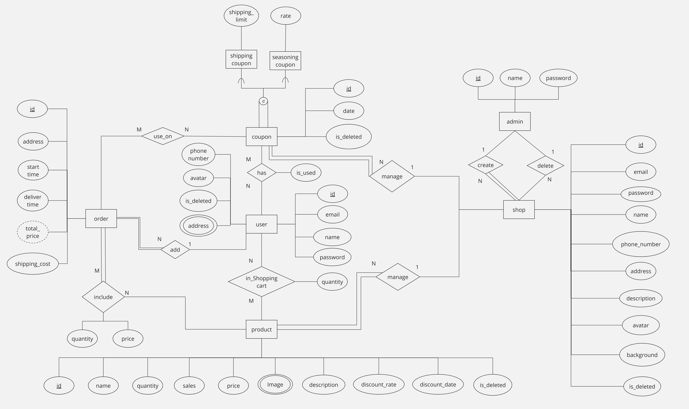

### Database Schema

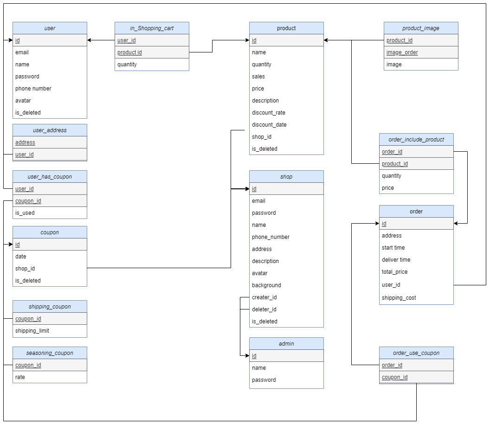

### Functional Dependencies

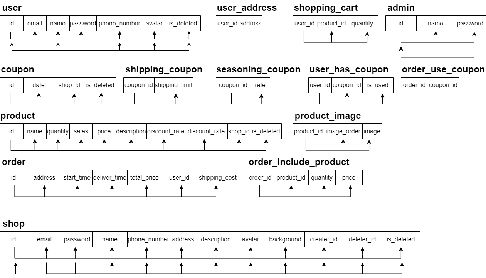

## Environment Setup

1. Install [Java 21](https://www.oracle.com/tw/java/technologies/downloads/)
2. Install [IntelliJ IDEA](https://www.jetbrains.com/idea/)
3. Install [Git](https://www.git-scm.com/download/win)
4. Install [PostgreSQL](https://www.enterprisedb.com/downloads/postgres-postgresql-downloads)
5. Create a database named `shopeehome`
6. Set the following environment variables:
   - `POSTGRES_USERNAME`:your PostgreSQL username
   - `POSTGRES_PASSWORD`:your PostgreSQL password

## Running the Project

### 1. Open in IntelliJ IDEA

Open the `backend` folder in IntelliJ IDEA.

Run **Maven Install** to download all dependencies:

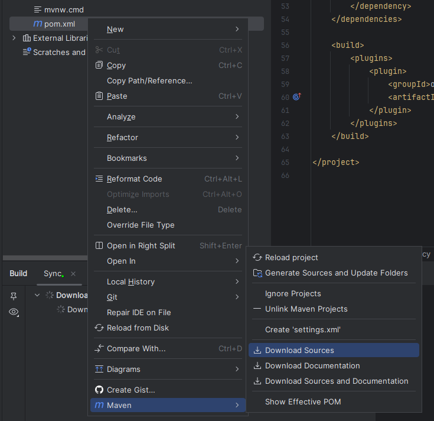

Set the project SDK to **Java 21** under Project Structure:

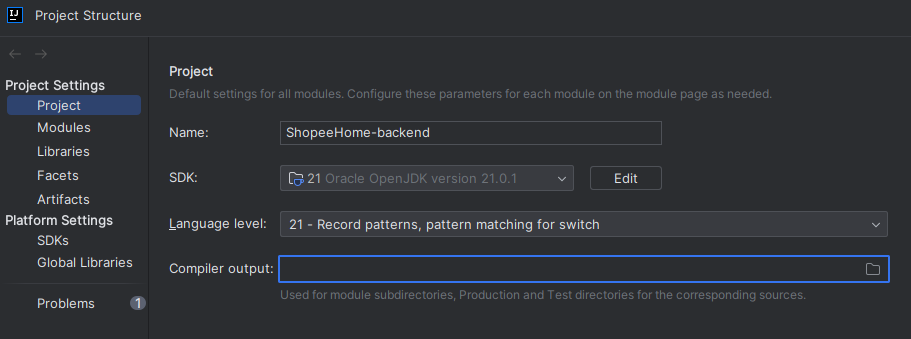

### 2. Connect to the Database

Configure the PostgreSQL data source in IntelliJ:

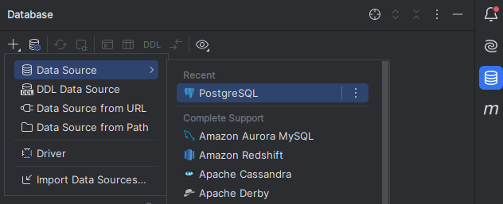
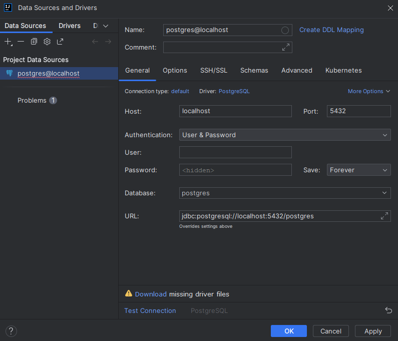
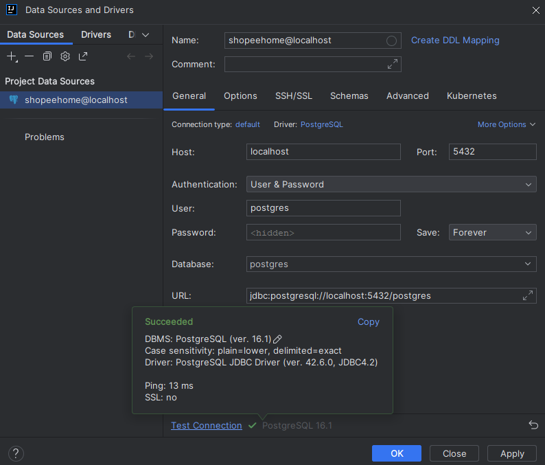

### 3. Create Database Tables

Locate `src/main/resources/database/create.sql` and execute it to create all tables:

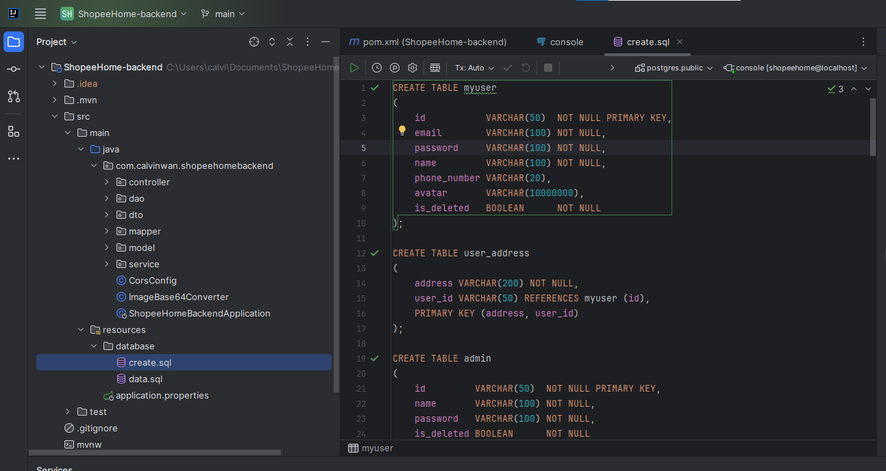

### 4. Run Tests

Run all tests to verify the backend is working correctly:

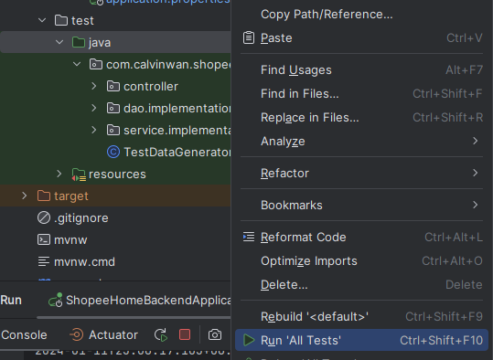
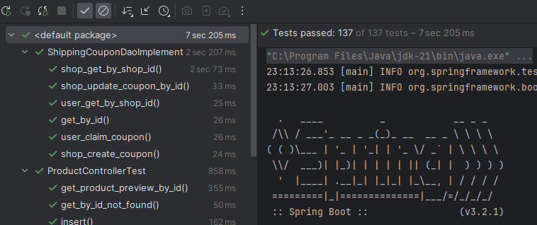

### 5. Generate Demo Data

Run `TestDataGenerator` to populate the database with sample data:

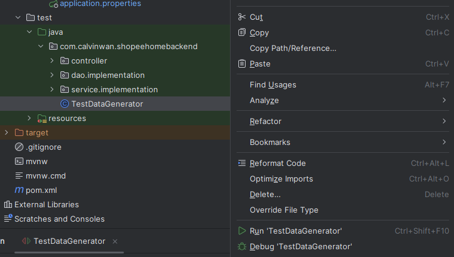

### 6. Start the Server

Run the application. The server starts on `http://localhost:8080`:

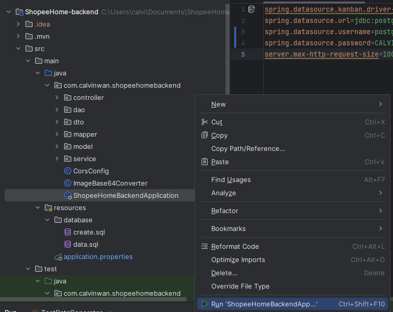
