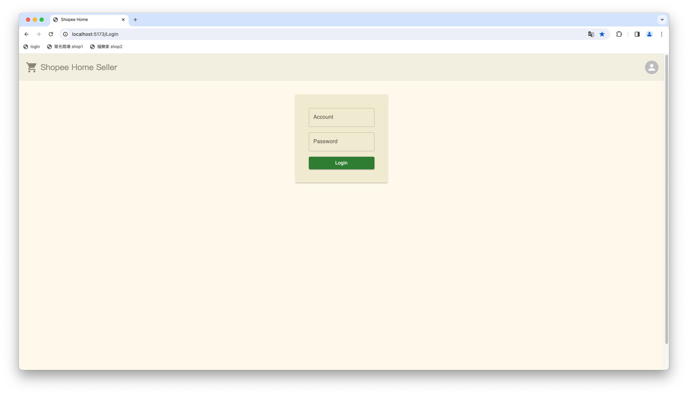
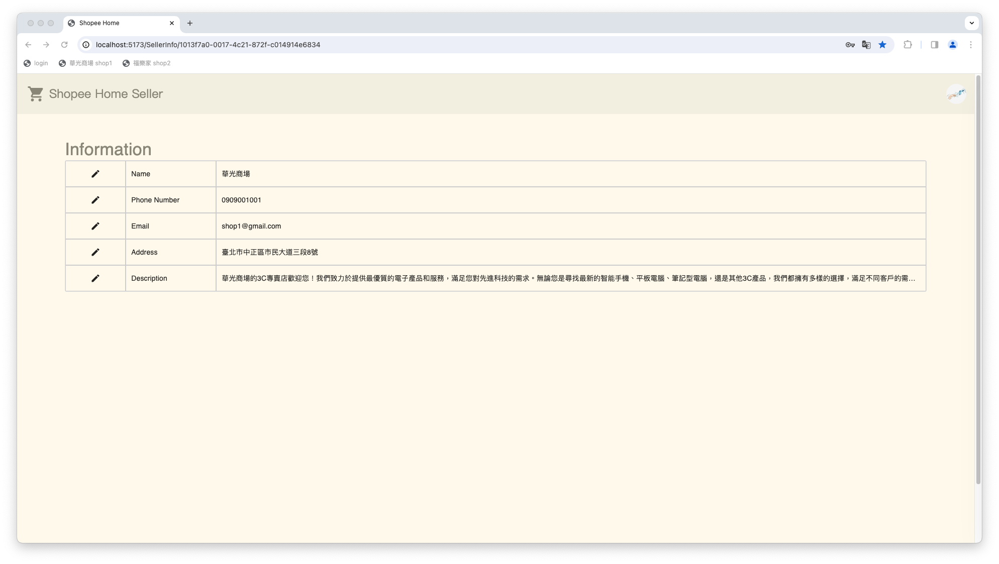
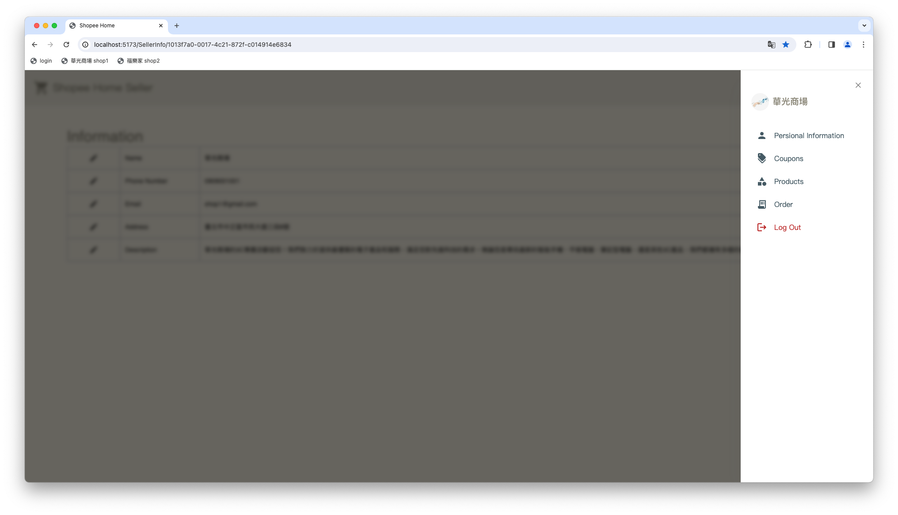
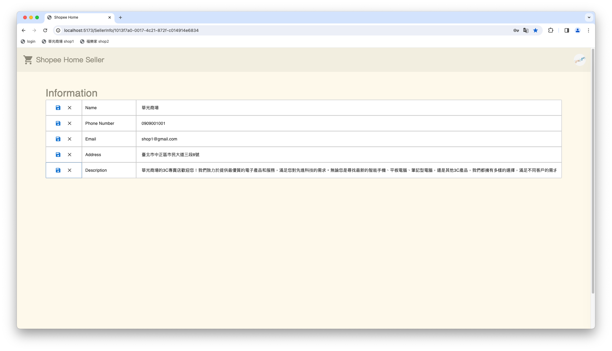
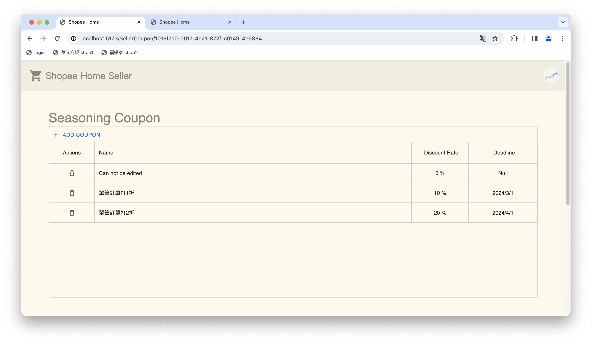
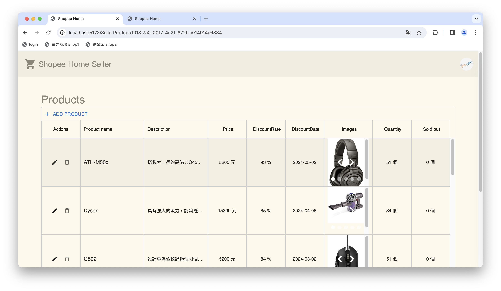
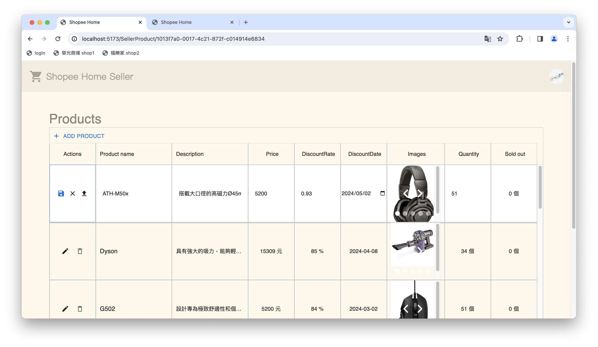
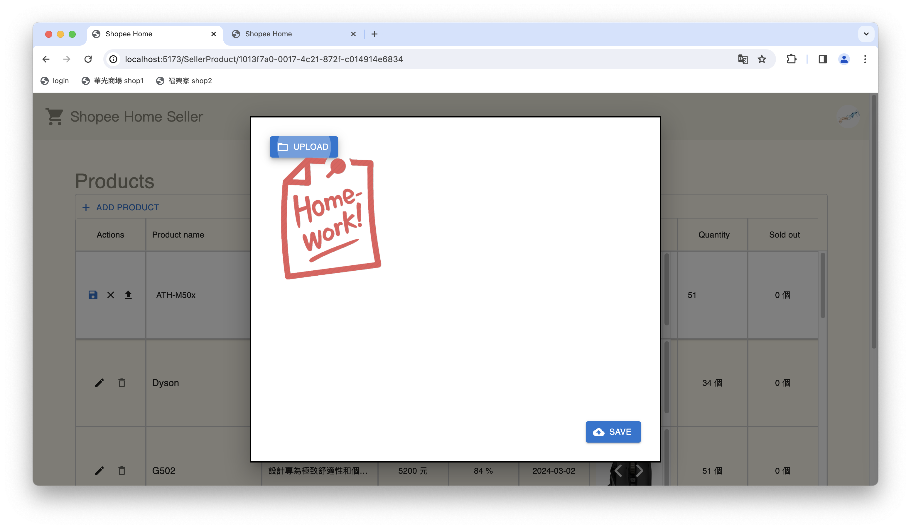
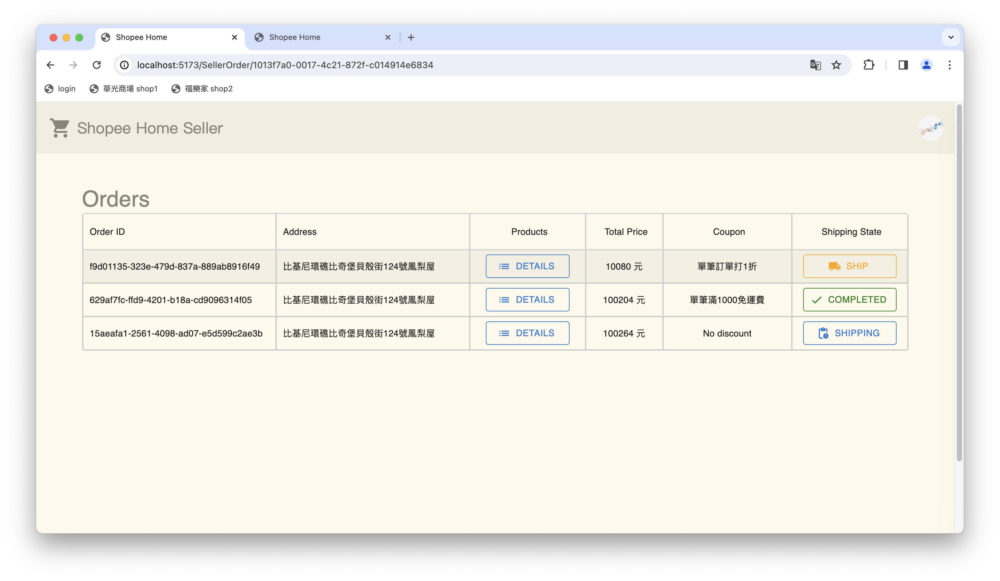

# ShopeeHome:Frontend (Shop)

React + TypeScript frontend for shop owners on the ShopeeHome e-commerce platform. This is a course project for the **2023 Database Systems** course at **National Taipei University of Technology (NTUT)**.

## Tech Stack

- **Framework**:React 18
- **Language**:TypeScript 5
- **Build Tool**:Vite
- **Styling**:Tailwind CSS, Sass, Material-UI
- **State Management**:Zustand
- **HTTP Client**:Axios
- **Router**:React Router DOM 6

## Installation

1. Install [Node.js](https://nodejs.org/)
2. Navigate to the `frontend/shop` directory and install dependencies:

   ```bash
   npm install
   ```

3. Start the development server:

   ```bash
   npm run dev
   ```

4. Open the URL shown in the terminal in a browser with CORS policy disabled (required for local development).

## Default Test Accounts

- `shop1@gmail.com` / `shop1`
- `shop2@gmail.com` / `shop2`

## How to Use

Without logging in, no shop management features are accessible.



After logging in, the shop management dashboard is displayed. Click the seller avatar on the right to navigate between pages or log out.




### Shop Profile Page

View and edit the shop's basic information:

- Shop name
- Phone number
- Email address
- Address
- Shop description

Click the **pencil icon** to enter edit mode. Click the **save icon** to confirm changes, or the **cancel icon** to discard them.




### Coupon Management Page

Add and delete two types of coupons:

- **Seasoning Coupon**:percentage discount applied to product prices
- **Shipping Coupon**:discount applied to shipping fees

Coupons cannot be edited after creation to avoid disputes. Coupon names are auto-generated based on type. Click **ADD COUPON** to create a coupon, or the **trash icon** to delete one.

**Field constraints:**

- Discount Rate and Discount Limit must be numeric and non-empty
- `0 < Discount Rate < 1`
- `0 ≤ Discount Limit`



### Product Management Page

Add, edit, and delete products with the following fields:

- Product name (required)
- Description
- Price (required)
- Discount rate (0–1; leave empty for no discount)
- Discount expiration date (required if discount is set)
- Stock quantity (default 0, must be non-negative)
- Sales count (read-only)
- Product images (upload after creating the product)

Click **ADD PRODUCT** to create a product. Use the **pencil icon** to edit, the **save icon** to confirm, the **cancel icon** to discard, the **trash icon** to delete, and the **upload icon** to add product images.





### Order Management Page

View all orders and update their shipping status. When a product has been shipped, click the orange **SHIP** button to advance the order to the next status.

Order status indicators:

- **SHIP** (Orange):Not yet shipped
- **SHIPPING** (Blue):Shipped, in transit
- **COMPLETED** (Green):Delivered

Click the blue **DETAILS** button to view the itemized order contents. A checkbox list is provided for order verification.


